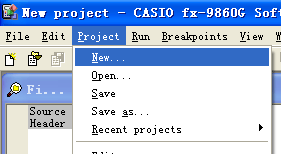
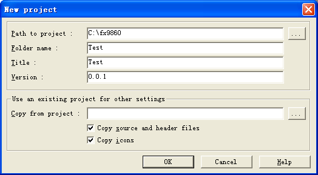
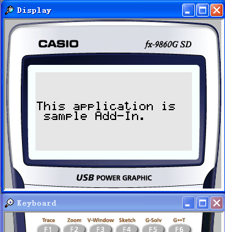

#fx-9860G SDK入门教程
##前言
在开始fx-9860G的开发之前，需要注意以下事项：  

*   64位的Windows无法正常运行SDK的编译器，请使用32位的系统来运行SDK（此教程中的SDK运行在一个32位的虚拟机中）。  
*    请确认自己的C语言基础，教程的代码完全使用C（并非C++）编写，但不会对C语法进行讲解。   

##准备
###安装fx-9860SDK
*   下载官方安装包安装即可，不需手动配置。  

###新建工程
1.   点击***Project - New***来创建新工程。   
  
2.  分别输入工程路径，工程文件夹名，工程名称与版本号来创建新工程。  
    
3.   SDK自动生成了一个显示文本的程序。点击***Project - Build***，或下方菜单栏的图标来组建工程。
4.   点击***Project - Run***，或下方菜单栏的图标，或按***F5***来运行Add-in  
    
到此工程的建立完成，可以开始写代码了。  
SDK的内置编辑器并不适合写代码（没有代码提示、没有高亮、没有自动缩进），可以选择Sublime、Notepad++或自己喜欢的编辑器来编写代码。  